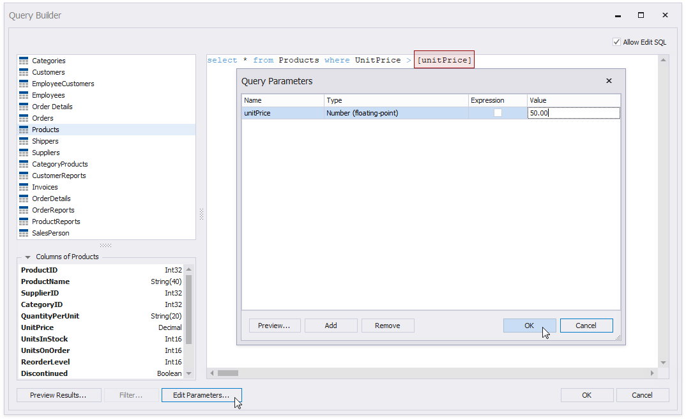
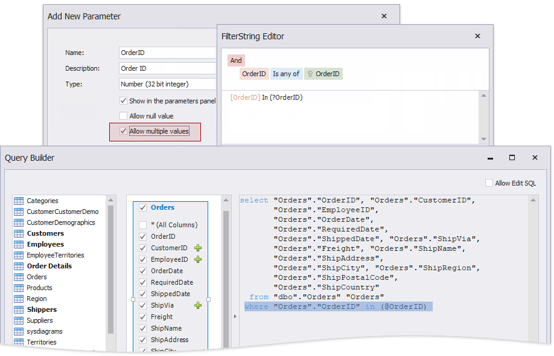

# Specify Query Parameters

Each query in an [SQL data source](bind-a-report-to-a-database.md) contains a collection of query parameters. A query parameter holds an external value that is inserted into an SQL statement before the query is executed. This value can be either static, if specified explicitly, or dynamic, when an [expression](../use-expressions.md) is evaluated to obtain a value.

The query parameter value is inserted into the SQL query string at the "\@QueryParameterName" placeholder's position.

Use query parameters to:

* **Filter report data at the data source level**

	The [Query Builder](../report-designer-tools/query-builder.md) helps you construct SQL queries when creating a new data-bound report or [binding a report to an SQL data source](bind-a-report-to-a-database.md).

	

	You can also add or edit queries in an SQL data source.

	

	Click **Edit Parameters**. Configure query parameter sin the invoked **Query Parameters** dialog.

	

	Click **Filter** to invoke the Filter Editor where you can specify filter conditions that include the created query parameters.

	

	The specified filter conditions are added as an SQL statement's WHERE part.

	The **Filter** button is not available for custom SQL queries. Specify the query parameter in the query instead.

	

* **Specify parameters for a stored procedure**

	The Report Wizard and Data Source Wizard include the **Create a query or select a stored procedure** page. If you select a stored procedure, the wizard creates a query parameter for each procedure parameter and allows you to configure the created parameters on the **Configure query parameters and preview the result page**.

	

Use the query's **Parameters** property to access the query parameters collection. These include parameters created in the Query Builder and generated for the data source's stored procedure. Use the query's **Filter String** property to access the query's filter string.

You can add query parameters in the Query Parameters dialog and modify the filter in the [FilterString Editor](../use-expressions.md#filterstring-editor).

## Configure Query Parameters

The following properties are available for a query parameter:

* **Name** - the parameter name.
* **Type** - the parameter value's data type.
* **Expression** - determines whether the parameter value is static or dynamic.
* **Value** - the parameter value. If the **Expression** option is enabled, this property contains an expression that is parsed and processed to obtain the parameter value. An expression can include data source fields or [report parameters](../shape-report-data/use-report-parameters.md).

## Specify the Query Parameter Value

Below, you can see how a value is specified for a query parameter within the Data Source Wizard's page. You can also specify query parameter values in the Report Wizard or the Query Parameters dialog in the same way.

* **Specify a static value**

	Choose a query parameter's value type and set a static value to the **Value** property according to the selected type.
	
	

* **Set a dynamic value**
	
	Activate the **Expression** checkbox for a parameter.
	
	The following three options are used to dynamically calculate the parameter's actual value:
	
	* Create a complex expression by expanding the **Value** property's drop-down list and selecting **Expression Editor**.
		
		
		
		Construct an expression in the invoked **Expression Editor**.
		
		

	* Map a new report parameter to a query parameter by expanding the **Value** property's drop-down list and selecting **New Report Parameter**.
		
		
		
		Specify report parameter settings in the invoked **Report Parameter** dialog. Remember to specify the report parameter type according to the type of the corresponding query parameter. Click **OK** to exit the dialog.
		
		

	* Map a report parameter that already exists in a report to a query parameter by expanding the **Value** property's drop-down list and selecting the parameter you want to use. An appropriate expression string is generated automatically.
		
		

## Pass a Multi-Value Parameter Value to a Query

You can bind query parameters to [multi-value parameters](../shape-report-data/use-report-parameters/multi-value-report-parameters.md). For instance, the following query selects the orders whose IDs are listed in the _\@OrderID_ query parameter.

## Pass a Multi-Value Report Parameter Value to a Stored Procedure

You cannot pass a [multi-value parameter](../shape-report-data/use-report-parameters/multi-value-report-parameters.md) value to a stored procedure directly. Use one of the following expression functions:

* Use the [Join() expression function](../use-expressions/expression-syntax.md) to convert the array of parameter values to a string if you use MS SQL Server, MySQL or Oracle database systems.

	

* Use the [CreateTable() expression function](../use-expressions/expression-syntax.md) to prepare a table using values of several multi-value parameters.

	