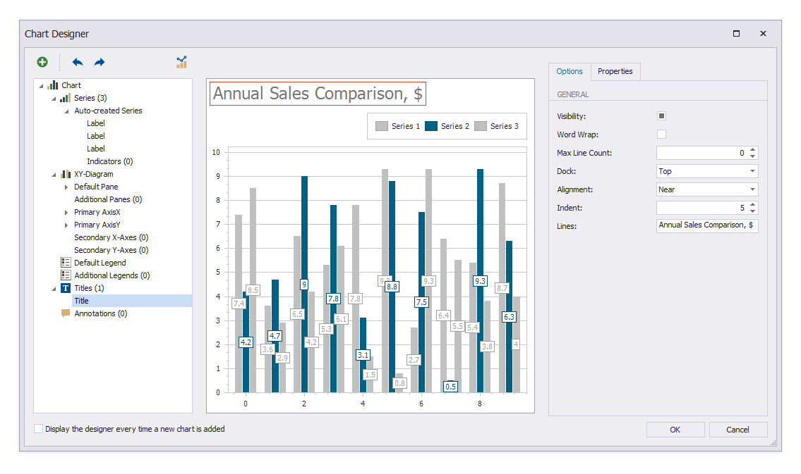
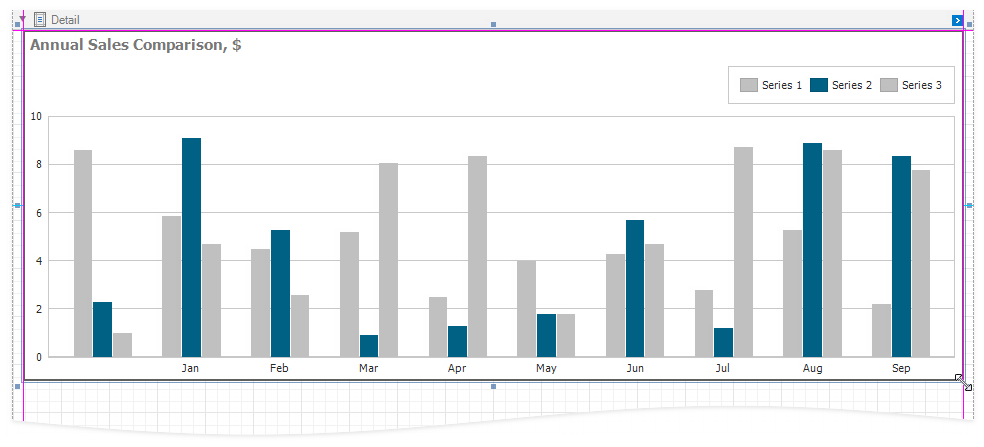
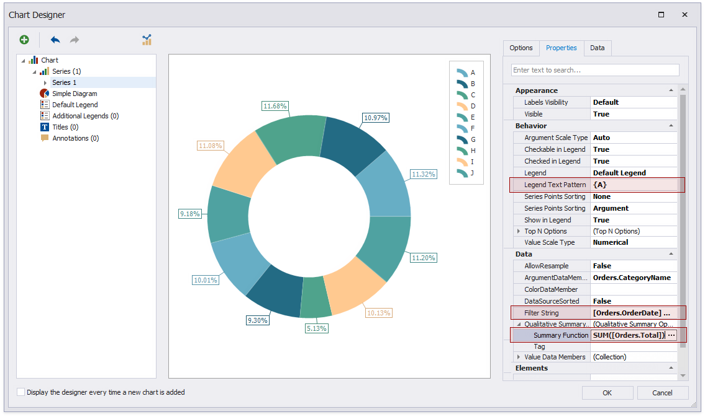

# Create a Report with Charts

This tutorial describes how to create a report that uses **Chart** controls to visualize data.

[Add a new blank report](../add-new-reports.md) to your application and follow the steps below to create a report with charts.

## Bind to Data

In this tutorial, the report is bound to a [federated data source](../bind-to-data/bind-a-report-to-a-federated-master-detail-data-source.md) that joins the order information from an SQL database with product categories stored as JSON data. The report's [data member](xref:DevExpress.XtraReports.UI.XtraReportBase.DataMember) is not set.

1. Create an [SQL data source](../bind-to-data/bind-a-report-to-a-database.md).

1. Create a [JSON data source](../bind-to-data/bind-a-report-to-json-data.md).

1. Create a Federation Data Source to unite the SQL and JSON data.

## Create the Report Layout

Select the report and enable the **Landscape** property. Set report margins to **55, 50, 50, 55**.

Add the following bands and controls to the report:

* **ReportHeader Band**

    Right-click the report and select **Insert Band | ReportHeader** from the context menu.

    

    Drop four XRLabel controls from the **Toolbox** onto the added ReportHeader band and set their properties:

    | Label | Property | Value |
    | --- | --- | --- |
    | Label1 | **Text** | _Sales Analysis 2019_ |
    | | **Font** | _Tahoma, 28pt, Bold_ |
    | | **ForeColor** | _0, 74, 101_ |
    | | **Size** | _570, 63_ |
    | | **Location** | _10, 0_ |
    | Label2 | **Text** | _1/1/2019 - 12/31/2019_ |
    | | **Font** | _Tahoma, 8pt, Bold_ |
    | | **ForeColor** | _Gray_ |
    | | **Size** | _570, 23_ |
    | | **Location** | _10, 63_ |
    | XRLabel3 | **Text** | _Total Sales_ |
    | | **Font** | _Tahoma, 11pt, Bold_ |
    | | **ForeColor** | _Gray_ |
    | | **Size** | _390, 23_ |
    | | **Location** | _600, 0_ |
    | XRLabel4 | **Expression** | _[SalesByCategory].[Sales]_ |
    | | **Format String** | _{0:$#,##0}_ |
    | | **Font** | _Tahoma, 22pt, Bold_ |
    | | **ForeColor** | _0, 74, 101_ |
    | | **Size** | _390, 40_ |
    | | **Location** | _600, 23_ |

The resulting report layout should look like on the image below.

## Add Charts to the Report

The Chart Report contains three charts:

* Annual Sales Comparison
* Quarterly Sales Distribution
* Product Categories

Add the Annual Sales Comparison chart to the report.

* Drop the **Chart** item from the [Toolbox](../report-designer-tools/toolbox.md) onto the **Detail** band.

    

* The **Chart Designer** wizard is invoked. Disable the **Display the designer every time a new chart is added** option if you do not want to trigger the wizard the next time you create a chart.

    

* Specify auto-created chart series. Switch to the **Data** tab and drop fields onto **Series**, **Argument**, and **Value**.

    

* Filter the chart data. Switch to the **Properties** tab and specify the filter condition in the **Data | SeriesTemplate | FilterString** property.

    

* Change the chart palette. Switch to the **Options** tab and expand the **Palette** property's drop-down list. Select a palette for the chart or click **Edit Palettes** to create a new palette.

    

* Align the chart legend at the top. Switch to the **Default Legend** node and set the **Alignment** and **Direction** properties.

    

* Add a title to the chart (click the plus button next to the **Titles** node). Specify the **Visibility**, **Dock**, **Alignment**, and **Lines** properties as shown on the image.

    

* Adjust the title's font settings. Switch to the **Properties** tab and set the font to *Tahoma, 11pt, style=Bold*.

    

* Hide the bar labels. Select the **Label** node and switch to the **Options** tab. Disable the **Visibility** property.

    

* Add month names to the chart's Argument axis. Select the **Primary AxisX** node and switch to the **Properties** tab. Click the **CustomLabels** property's ellipsis button. Add a record for each month in the invoked **Collection Editor**. Click **Close** when done.

    

* Click **OK** to close the **Chart Designer**. Drag the chart corners to resize the control.

    

Add the Quarterly Sales Distribution chart to the report.

* Drop the **XRChart** item from the **Toolbox** onto the **Detail** band.

    

* If you disabled the **Display the designer every time a new chart is added** option in the **Chart Designer**, expand the new chart's smart tag and click **Run Designer**.

    

* Specify auto-created chart series. Switch to the **Data** tab and drop fields onto **Series**, **Argument**, and **Value**.

    

* Change the chart palette colors the same way as for the Annual Sales Comparison chart.

    

* Orient the chart horizontally. Select the **XY-Diagram** node, enable the **Rotated** property, and set **Pane Layout Direction** to *Horizontal*.

    

* Specify custom labels the same way as for the Annual Sales Comparison chart. Add custom labels for Quarters 1, 2, 3, and 4.

    

* Rotate the Value axis captions. Select the **Primary AxisY** node and set the **Elements | Label | Angle** property to _45_.

    

* Hide the chart legend. Select the **Default Legend** node, switch to the **Options** tab, and disable the **Visibility** property.

    

* Add a chart title the same way as for the Annual Sales Comparison chart.

    

* Change the chart's view type. Select the **Auto-created Series** node and set the **View** property to _StackedBar_. Click **OK** to close the **Chart Designer**.

    

Add the Product Categories chart to the report.

* Drop the **XRChart** item from the **Toolbox** onto the **Detail** band.

    

* If you disabled the **Display the designer every time a new chart is added** option in the **Chart Designer**, expand the new chart's smart tag and click **Run Designer**.

    

* Change the chart palette colors the same way as for the previous charts.

    

* Create a chart series. Click the plus button next to the **Series** node and select the **Doughnut** series type.

    

* Specify chart points. Switch to the **Data** tab and drop fields onto **Argument** and **Value**.

    

* Shape the series data. Switch to the **Properties** tab and set the **Behavior | LegendTextPattern** property to _{A}_. Set **Data | FilterString** to _[Orders.OrderDate] >= #2019-01-01# And [Orders.OrderDate] < #2020-01-01#_. Set **Data | QualitativeSummaryOptions | SummaryFunction** to _SUM([Orders.Total])_.

    

* Specify to display point labels inside the chart slices. Select the **Label** node and switch to the **Options** tab. Set the **General | Position** property to _Inside_. Set **Text Options | Text Pattern** to _{VP:0%}_.

    

* Add the chart title the same way as the previous charts. Click **OK** to close the **Chart Designer** when you are done.

    

## View the Result

The report is ready. Switch to **Preview** to view the report.

